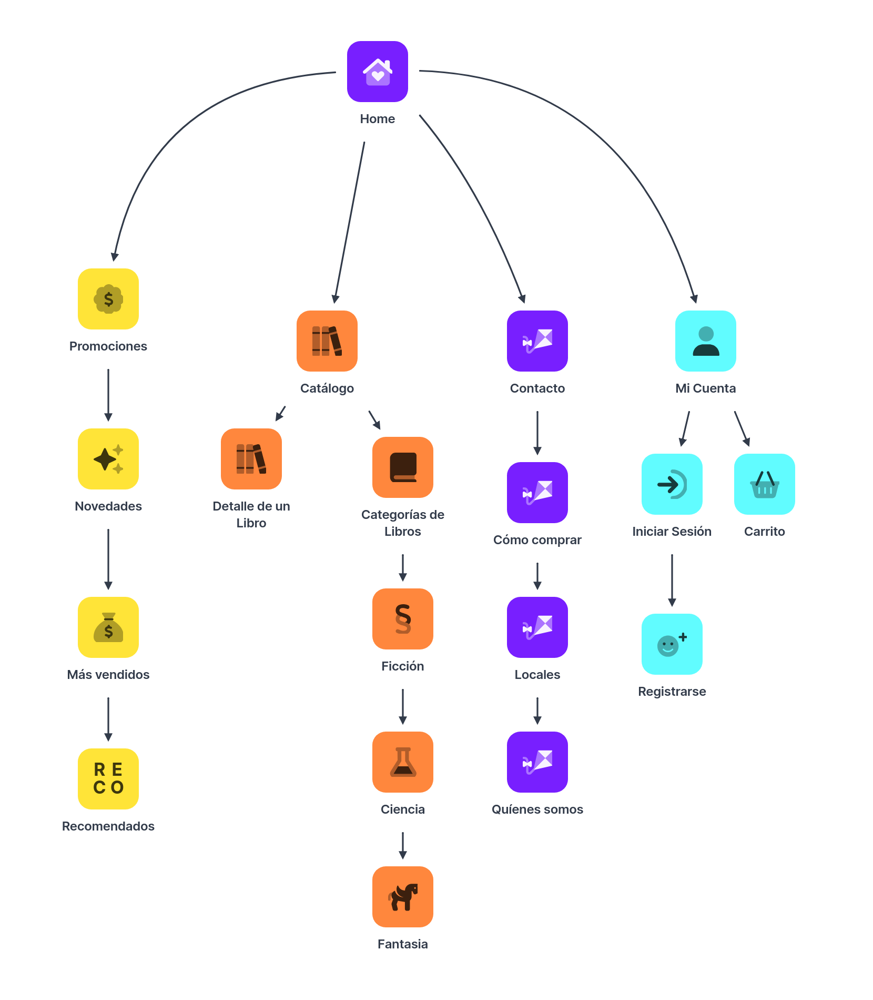

# Trabajo Práctico - PAWPrints

## Programación en Ambiente Web

### **Integrantes**

- Buzzo Marcelo, Rocco   |   Legajo: 190292
- Cardona, Eliana        |   Legajo: 118441
- Pereyra Buch, Bautista |   Legajo 193177

## Entrega 1

El proyecto que les proponemos es la Web de una librería (venta de libros) llamada PAWPrints. Las etapas a desarrollar en este TP serán:

- Realizar un SiteMap del Sitio, planteando la jerarquía de las secciones y las páginas.

> 

- Diseñar wireframes low-fi en Figma para representar las pantallas principales del sitio web.

> Link al [Wireframe](https://www.figma.com/design/iVTO3usGiNgsAN9lrRd9ko/TP1-PAW?node-id=0-1&p=f&t=Weh9avHT0X2SWn6c-0)

- Maquetar el sitio web usando solo HTML5, siguiendo las pautas de los wireframes.
- Demostrar la correcta utilización de los elementos semánticos de HTML5. Refleje en cada sección los tags HTML que mejor consideren que se adaptan al contenido de la página a mostrar.
- Crear un formulario de reserva de libro para demostrar el uso adecuado de los formularios HTML, utilizando los tags y atributos que considere que mejor se adapten al tipo de dato del campo, para facilitar la validación.

> Link al [Repositorio](https://github.com/roccobuzzomarcelo/PAW-2025-TPS/tree/main/home)
